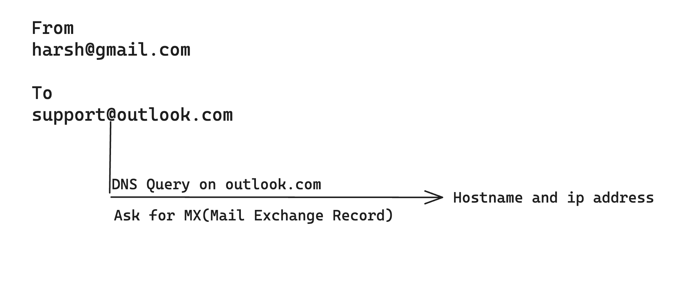
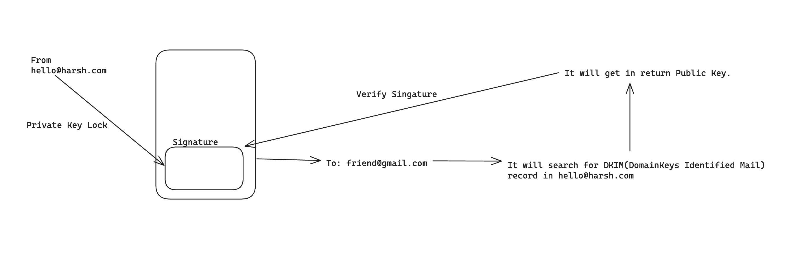
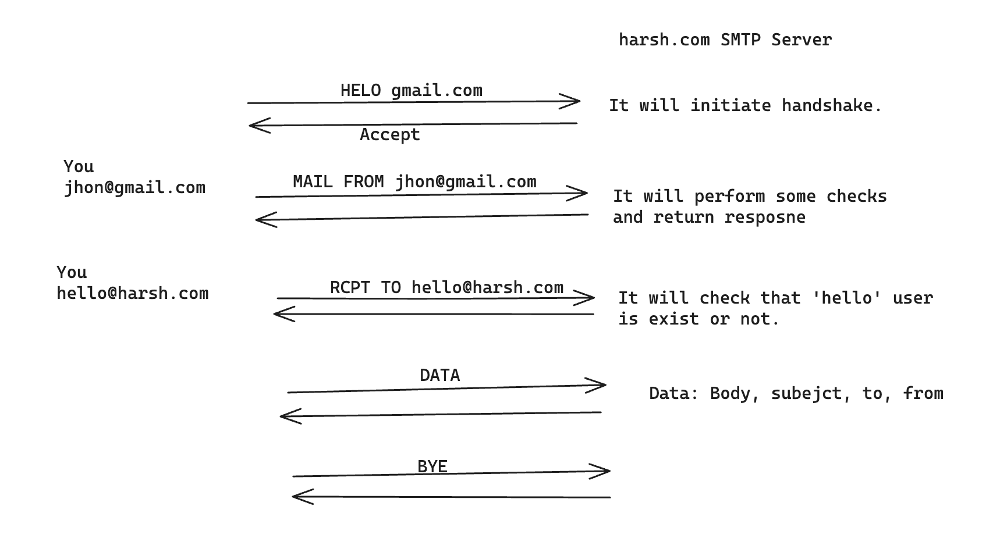

## Refs:
1. To find the MX record. -> https://mxtoolbox.com/
2. How to find the receiver's the hostname and ip.

3. Using below architecture mail system can be more legit and genuine.

4. If above DKIM check is failed(means public key will not match the signature or due to any other reason) then DMARC can do following things,
None = Accept and send it to inbox
Quarantine = Send it to SPAM folder
REJECT = Will not accept and will not send to INBOX
5. We generally makes HTTP REST APIs to talk to server but here we need to make SMTP server and SMTP default PORT is 25 and SMTPS default PORT is 465.
6. Overall, Lets take one domain. If someone sends mail on gmailclone.com and it's MX record is mail.gmailclone.com and now this mail.gmailclone.com has 'A' record and it contains ip address(1.2.3.4) using which we can talk to SMTP server.
7. SMTP uses on TCP.
8. To make SMTP server, like http module in NodeJS we have 'net' module for this but it is difficult to make SMTP server because we have to write everything. So like express we can use 'smtp-server'.
9. In http we have GET, POST methods and status codes(2xx, 4xx,...). Similarly, In SMTP we have commands. 
https://mailtrap.io/blog/smtp-commands-and-responses/
10. 
11. https://nodemailer.com/extras/smtp-server/